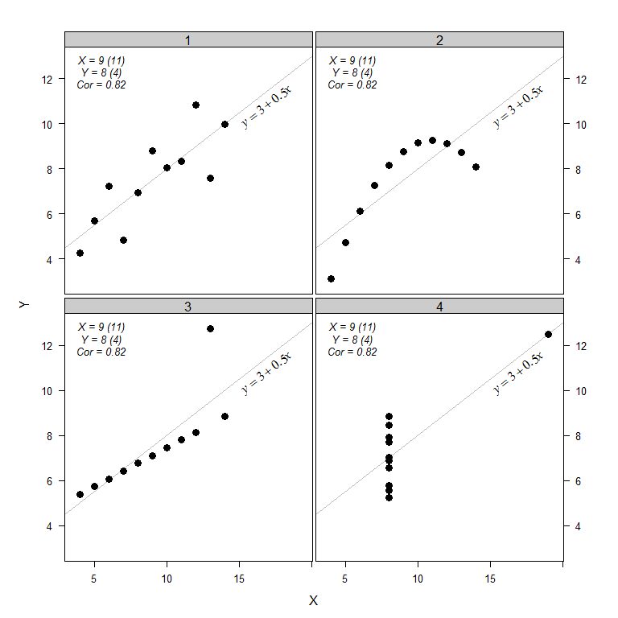

Anscombe Data
================
A Calatroni & J Wildfire
27 February, 2017

-   [packages](#packages)
-   [data](#data)
-   [reshape](#reshape)
-   [figure](#figure)

### packages

``` r
pacman::p_load(lattice, latticeExtra, grid, reshape2)
```

### data

``` r
data(anscombe)
anscombe$id <- rownames(anscombe)
```

### reshape

``` r
anscombe.m <- melt(anscombe,id.var="id")
anscombe.m$var1 <- substr(anscombe.m$variable,1,1)
anscombe.m$var2 <- substr(anscombe.m$variable,2,3)
anscombe.c <- dcast(anscombe.m,id+var2~var1)
```

### figure

``` r
xyplot(y~x|var2,data=anscombe.c,
       as.table = T, col="black", pch=16, cex=1.1, fill="black", asp=1,
       xlab="X",ylab="Y",
       between=list(x=0.25,y=0.25),
       scale=list(x=list(alternating=F,tck=c(1,0)),
                  y=list(alternating=3,tck=c(1,1))),
       par.settings=list(strip.background=list(col="gray80")),
       panel = function(x, y, ...) {
         grid.text(paste0("X = ", round(mean(x),0)," (",round(var(x),0),")") ,0.15,0.95, gp=gpar(cex=0.80, font=3))
         grid.text(paste0("Y = ", round(mean(y),0)," (",round(var(y),0),")") ,0.15,0.90, gp=gpar(cex=0.80, font=3))
         grid.text(paste0("Cor = ", round(cor(x,y),2)) ,0.15,0.85, gp=gpar(cex=0.80, font=3))
         panel.lmlineq(x, y, adj = c(1,0), lty = 1, at=0.8, rotate=T,
                       col.line = "grey", digits = 2)
         panel.xyplot(x, y, ...)}
)
```


