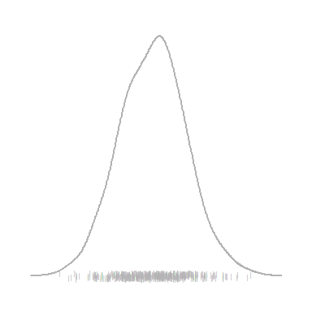
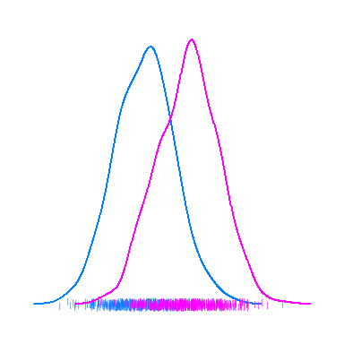

Densityplot
================
A Calatroni & J Wildfire
27 February, 2017

-   [packages](#packages)
-   [create data](#create-data)
-   [Raw Data](#raw-data)
-   [Trasfrom](#trasfrom)
-   [Compare](#compare)
-   [Annotate](#annotate)
-   [Expand](#expand)

### packages

``` r
pacman::p_load(lattice, grid)
pacman::p_load(tidyverse)
pacman::p_load(pixiedust)
```

### create data

``` r
set.seed(2016)
dd1 <- data.frame(x = rnorm(500), g = 1 %>% as.factor())
dd2 <- data.frame(x = rnorm(500, 1.5, 1), g = 2 %>% as.factor())
dd2 <- rbind(dd1,dd2)

dd2$f <- "A"
set.seed(2016)
dd1_b <- data.frame(x = rnorm(500, 0.90, 0.95), g = 1 %>% as.factor())
dd2_b <- data.frame(x = rnorm(500, 1.05, 1.35), g = 2 %>% as.factor())
dd2_b <- rbind(dd1_b,dd2_b)
dd2_b$f <- "B"
dd3 <- rbind(dd2,dd2_b)
```

### Raw Data

``` r
dotplot(g ~ x, data=dd1,
        col='gray70',
        scales=list(draw=F),
        xlab=NULL, ylab=NULL,
        par.settings = list(axis.line = list(col = 0)),
        panel = function(x,y,...){
          panel.points(x,y,...)
        })
```


### Trasfrom

``` r
densityplot(~x, data=dd1, 
          col='gray70', lwd=2, bw = 0.30, 
          pch="|",
          scales=list(draw=F), 
          xlab=NULL, ylab=NULL,
          par.settings = list(axis.line = list(col = 0)) )
```



### Compare

``` r
densityplot( ~x, data=dd2, groups=g, 
             lwd=2, bw = 0.30, 
             pch="|",
             scales=list(draw=F), 
             xlab=NULL, ylab=NULL,
             par.settings = list(axis.line = list(col = 0)) )
```



### Annotate

``` r
pal   <- c("gray35","gray50","gray65","gray80","white")
ind   <- c(1,0.1,0.05,0.01,0.001,0)

densityplot( ~x, data=dd2, groups=g, 
             lwd=3, bw = 0.30, 
             pch="|",
             scales=list(draw=F), 
             xlab=NULL, ylab=NULL,
             par.settings = list(axis.line = list(col = 0)) ,
             legend = list(top=list(fun=grid::textGrob("P-Value", x=1.06)),
                           right = list(fun = draw.colorkey,
                                        args = list(key = list(col = rev(pal), at = seq(0,1,length=6), 
                                                               labels=list(at=seq(0,1,length=6),labels=ind)), 
                                                    draw = FALSE))),
             panel = function (x, groups, subscripts,...){
               
               t <- t.test(x~groups[subscripts])
               e <- format(t$estimate, digits = 2, nsmall = 2)
               i <- format(t$conf.int, digits = 2, nsmall = 2)
               d <- format(diff(t$estimate), digits = 2, nsmall = 2)
               
               pal   <- c("gray35","gray50","gray65","gray80","white")
               ind   <- c(1,0.1,0.05,0.01,0.001,0)
               
               col.ind <- cut(t$p.value,breaks=ind,labels=FALSE)               
               panel.fill(col = pal[col.ind])
               
               panel.superpose(x, subscripts=subscripts, groups=groups, ...)
               
               grid.text(paste(d," (",i[1]," , ",i[2],") \n p ", pvalString(t$p.value),sep=""),
                         x=0.98,y=0.95, just='right', gp=gpar(cex=0.7,fontface=ifelse(t$p.value<0.05,2,1)))
             },
             panel.groups = function(x, group.number, ...) {
               
               m  <- round(mean(x,na.rm=T),1)
               
               d <- density(x)
               panel.polygon(d$x,d$y, border=NA, col=trellis.par.get('superpose.polygon')$col[group.number],alpha=0.4)
               panel.lines(x=d$x, y=d$y, col=trellis.par.get('superpose.line')$col[group.number], lwd=2)
               
               # Create a line at the mean
               diffs  <-abs(d$x-m)
               lx  <- d$x[diffs==min(diffs)]
               ly  <- d$y[diffs==min(diffs)]
               panel.lines(x=c(lx,lx),y=c(0,ly),col=trellis.par.get('superpose.line')$col[group.number])
               panel.text(x=lx, y=ly, label = format(lx, digits = 2, nsmall = 2),
                          cex=0.7,
                          adj=c(0.5,-0.8),
                          col=trellis.par.get('superpose.line')$col[group.number])
             })
```


### Expand

``` r
densityplot(~x | f, data=dd3, groups=g, as.table=T,
            scales=list(draw=F),
            between = list(y=0.5),
            xlab=NULL, ylab=NULL,
            par.settings = list(axis.line = list(col = 0),
                                strip.background=list(col="gray90")),
           legend = list(top=list(fun=grid::textGrob("P-Value", x=1.06)),
                         right = list(fun = draw.colorkey,
                                      args = list(key = list(col = rev(pal), at = seq(0,1,length=6), 
                                                             labels=list(at=seq(0,1,length=6),labels=ind)), 
                                                  draw = FALSE))),
           panel = function (x, groups, subscripts,...){
             
             t <- t.test(x~groups[subscripts])
             e <- format(t$estimate, digits = 2, nsmall = 2)
             i <- format(t$conf.int, digits = 2, nsmall = 2)
             d <- format(diff(t$estimate), digits = 2, nsmall = 2)
             
             pal   <- c("gray35","gray50","gray65","gray80","white")
             ind   <- c(1,0.1,0.05,0.01,0.001,0)
             
             col.ind <- cut(t$p.value,breaks=ind,labels=FALSE)               
             panel.fill(col = pal[col.ind])
             
             panel.superpose(x, subscripts=subscripts, groups=groups, ...)
             
             grid.text(paste(d," (",i[1]," , ",i[2],") \n p ", pvalString(t$p.value),sep=""),
                       x=0.98,y=0.93, just='right', gp=gpar(cex=0.7,fontface=ifelse(t$p.value<0.05,2,1)))
           },
           panel.groups = function(x, group.number, ...) {
             
             m  <- round(mean(x,na.rm=T),1)
             
             d <- density(x)
             panel.polygon(d$x,d$y, border=NA, col=trellis.par.get('superpose.polygon')$col[group.number],alpha=0.4)
             panel.lines(x=d$x, y=d$y, col=trellis.par.get('superpose.line')$col[group.number], lwd=2)
             
             # Create a line at the mean
             diffs  <-abs(d$x-m)
             lx  <- d$x[diffs==min(diffs)]
             ly  <- d$y[diffs==min(diffs)]
             panel.lines(x=c(lx,lx),y=c(0,ly),col=trellis.par.get('superpose.line')$col[group.number])
             panel.text(x=lx, y=ly, label = format(lx, digits = 2, nsmall = 2),
                        cex=0.7,
                        adj=c(0.5,-0.8),
                        col=trellis.par.get('superpose.line')$col[group.number])
           })
```


