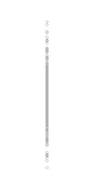
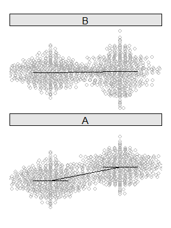

Dotplots
================
A Calatroni & J Wildfire
27 February, 2017

-   [packages](#packages)
-   [create data](#create-data)
-   [Raw Data](#raw-data)
-   [Trasfrom](#trasfrom)
-   [Compare](#compare)
-   [Annotate](#annotate)
-   [Expand](#expand)

### packages

``` r
pacman::p_load(lattice, grid)
pacman::p_load(tidyverse)
pacman::p_load(pixiedust)
```

### create data

``` r
set.seed(2016)
dd1 <- data.frame(x = rnorm(500), g = 1 %>% as.factor())
dd2 <- data.frame(x = rnorm(500, 1.5, 1), g = 2 %>% as.factor())
dd2 <- rbind(dd1,dd2)

dd2$f <- "A"
set.seed(2016)
dd1_b <- data.frame(x = rnorm(500, 0.90, 0.95), g = 1 %>% as.factor())
dd2_b <- data.frame(x = rnorm(500, 1.05, 1.35), g = 2 %>% as.factor())
dd2_b <- rbind(dd1_b,dd2_b)
dd2_b$f <- "B"
dd3 <- rbind(dd2,dd2_b)
```

### Raw Data

``` r
dotplot(x ~ g, data=dd1,
        col='gray70',
        horizontal = F,
        scales=list(draw=F), 
        xlab=NULL, ylab=NULL,
        par.settings = list(axis.line = list(col = 0)),
        panel = function(x,y,...){
          panel.points(x,y,...)
        })
```



### Trasfrom

``` r
pacman::p_load(beeswarm)
stripplot(x~g, data=dd1,
          col='gray70',
          horizontal = F,
          scales=list(draw=F), 
          xlab=NULL, ylab=NULL,
          par.settings = list(axis.line = list(col = 0)),
          panel = function(x,y,...){
            dd <-  beeswarm(y~x,method='swarm',do.plot=F,spacing=0.6,...)
            panel.points(dd$x,dd$y,...)
          })
```


### Compare

``` r
stripplot(x~g, data=dd2,
          col='gray70',
          horizontal = F,
          scales=list(draw=F), 
          xlab=NULL, ylab=NULL,
          par.settings = list(axis.line = list(col = 0)),
          panel = function(x,y,...){
            dd <-  beeswarm(y~x,method='swarm',do.plot=F,spacing=1.0,...)
            panel.points(dd$x,dd$y,...)
          })
```


### Annotate

``` r
pal   <- c("gray35","gray50","gray65","gray80","white")
ind   <- c(1,0.1,0.05,0.01,0.001,0)

stripplot(x~g, data=dd2,
          col='gray70',
          horizontal = F,
          scales=list(draw=F), 
          xlab=NULL, ylab=NULL,
          par.settings = list(axis.line = list(col = 0)),
          legend = list(top=list(fun=grid::textGrob("P-Value", x=1.06)),
                        right = list(fun = draw.colorkey,
                                     args = list(key = list(col = rev(pal), at = seq(0,1,length=6), 
                                                            labels=list(at=seq(0,1,length=6),labels=ind)), 
                                                 draw = FALSE))),
          panel = function(x,y,...){
            
            t <- t.test(y~x)
            m <- tapply(y,x, mean)
            e <- format(t$estimate, digits = 1, nsmall = 1)
            i <- format(t$conf.int, digits = 1, nsmall = 1)
            d <- format(diff(t$estimate), digits = 1, nsmall = 1)
            
            col.ind <- cut(t$p.value,breaks=ind,labels=FALSE)               
            panel.fill(col = pal[col.ind])

            dd <-  beeswarm(y~x,method='swarm',do.plot=F,spacing=1.2,...)
            panel.points(dd$x,dd$y,...)
            panel.segments(x0=seq(0.75,1.75), y0=m, x1=seq(1.25,2.25), y1=m)
            panel.xyplot(c(1,2),m, type=c("a"), col='black')
            
            grid.text(e,x=unit(c(1,2),"native"),y=unit(m,"native"),hjust=0.5,vjust=-0.5,gp=gpar(cex=0.7)) 
            
            grid.text(paste(d," (",i[1]," , ",i[2],") \n p ", pvalString(t$p.value),sep=""),
                      x=0.50,y=0.95,hjust=0.5,gp=gpar(cex=0.7,fontface=ifelse(t$p.value<0.05,2,1)))
            
            
          })
```



### Expand

``` r
stripplot(x~g|f, data=dd3,
          col='gray70',
          horizontal = F,
          scales=list(draw=F), 
          between = list(x=0.5),
          xlab=NULL, ylab=NULL,
          par.settings = list(axis.line = list(col = 0),
                              strip.background=list(col="gray90")),
          legend = list(top=list(fun=grid::textGrob("P-Value", x=1.06)),
                        right = list(fun = draw.colorkey,
                                     args = list(key = list(col = rev(pal), at = seq(0,1,length=6), 
                                                            labels=list(at=seq(0,1,length=6),labels=ind)), 
                                                 draw = FALSE))),
          panel = function(x,y,...){
            
            t <- t.test(y~x)
            m <- tapply(y,x, mean)
            e <- format(t$estimate, digits = 1, nsmall = 1)
            i <- format(t$conf.int, digits = 1, nsmall = 1)
            d <- format(diff(t$estimate), digits = 1, nsmall = 1)
            
            col.ind <- cut(t$p.value,breaks=ind,labels=FALSE)               
            panel.fill(col = pal[col.ind])
            
            dd <-  beeswarm(y~x,method='swarm',do.plot=F,spacing=1.8,...)
            panel.points(dd$x,dd$y,...)
            panel.segments(x0=seq(0.75,1.75), y0=m, x1=seq(1.25,2.25), y1=m)
            panel.xyplot(c(1,2),m, type=c("a"), col='black')
            
            grid.text(e,x=unit(c(1,2),"native"),y=unit(m,"native"),hjust=0.5,vjust=-0.5,gp=gpar(cex=0.7)) 
            
            grid.text(paste(d," (",i[1]," , ",i[2],") \n p ", pvalString(t$p.value),sep=""),
                      x=0.50,y=0.95,hjust=0.5,gp=gpar(cex=0.7,fontface=ifelse(t$p.value<0.05,2,1)))
            
          })
```


