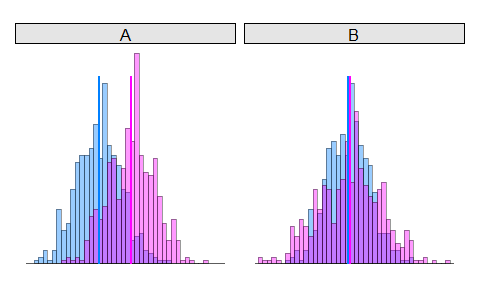

Histograms
================
A Calatroni & J Wildfire
08 May, 2017

-   [packages](#packages)
-   [create data](#create-data)
-   [Raw Data](#raw-data)
-   [Trasfrom](#trasfrom)
-   [Compare](#compare)
-   [Expand](#expand)
-   [Annotate](#annotate)

### packages

``` r
pacman::p_load(lattice, grid)
pacman::p_load(tidyverse)
pacman::p_load(pixiedust) # for pvalString
```

### create data

``` r
set.seed(2016)
dd1 <- data.frame(x = rnorm(500), g = 1 %>% as.factor())
dd2 <- data.frame(x = rnorm(500, 1.5, 1), g = 2 %>% as.factor())
dd2 <- rbind(dd1,dd2)

dd2$f <- "A"
set.seed(2016)
dd1_b <- data.frame(x = rnorm(500, 0.90, 0.95), g = 1 %>% as.factor())
dd2_b <- data.frame(x = rnorm(500, 1.05, 1.35), g = 2 %>% as.factor())
dd2_b <- rbind(dd1_b,dd2_b)
dd2_b$f <- "B"
dd3 <- rbind(dd2,dd2_b)
```

### Raw Data

``` r
dotplot(g ~ x, data=dd1,
        col='gray70',
        scales=list(draw=F),
        xlab=NULL, ylab=NULL,
        par.settings = list(axis.line = list(col = 0)),
        panel = function(x,y,...){
          panel.points(x,y,...)
        })
```


### Trasfrom

``` r
histogram(~x, data=dd1,
          col='gray70', breaks=30, 
          scales=list(draw=F), 
          ylim=c(0,13),
          xlab=NULL, ylab=NULL,
          par.settings = list(axis.line = list(col = 0)) )
```


### Compare

``` r
histogram( ~x, data=dd2, groups=g, 
           breaks=30, 
           scales=list(draw=F),
           ylim=c(0,13),
           xlab=NULL, ylab=NULL,
           par.settings = list(axis.line = list(col = 0)),
           panel = function(...){
             panel.superpose(...,
                             panel.groups=panel.histogram,
                             col=c("#0080ff","#ff00ff"),
                             alpha=0.4)
           } )
```


### Expand

``` r
histogram( ~x | f , data=dd3, groups=g, 
           breaks=30, as.table=T,
           scales=list(draw=F),
           between = list(y=0.5),
           ylim=c(0,13),
           xlab=NULL, ylab=NULL,
           par.settings = list(axis.line = list(col = 0),
                               strip.background=list(col="gray90")),
         
           panel = function (x, groups, subscripts,...){
             
             t <- t.test(x~groups[subscripts])
             e <- format(t$estimate, digits = 2, nsmall = 2)
           
             panel.superpose(x, 
                             subscripts=subscripts, 
                             groups=groups,
                             col=c("#0080ff","#ff00ff"),
                             alpha = 0.4,
                             panel.groups=panel.histogram,...)
             
             panel.segments(x0=e,y0=unit(0,'npc'),x1=e, y1=unit(0.85,'npc'),col=c("#0080ff","#ff00ff"),lwd=2)
           })
```



### Annotate

``` r
pal   <- c("gray35","gray50","gray65","gray80","white")
ind   <- c(1,0.1,0.05,0.01,0.001,0)
histogram( ~x | f, data=dd3, groups=g, 
           breaks=30, as.table=T,
           scales=list(draw=F),
           between = list(y=0.5),
           ylim=c(0,13),
           xlab=NULL, ylab=NULL,
           par.settings = list(axis.line = list(col = 0),
                               strip.background=list(col="gray90")),
           legend = list(top=list(fun=grid::textGrob("P-Value", x=1.06)),
                         right = list(fun = draw.colorkey,
                                      args = list(key = list(col = rev(pal), at = seq(0,1,length=6), 
                                                             labels=list(at=seq(0,1,length=6),labels=ind)), 
                                                  draw = FALSE))),
           panel = function (x, groups, subscripts,...){
             
             t <- t.test(x~groups[subscripts])
             e <- format(t$estimate, digits = 2, nsmall = 2)
             i <- format(t$conf.int, digits = 2, nsmall = 2)
             d <- format(diff(t$estimate), digits = 2, nsmall = 2)
             
             pal   <- c("gray35","gray50","gray65","gray80","white")
             ind   <- c(1,0.1,0.05,0.01,0.001,0)
             
             col.ind <- cut(t$p.value,breaks=ind,labels=FALSE)               
             panel.fill(col = pal[col.ind])
             
             panel.superpose(x, 
                             subscripts=subscripts, 
                             groups=groups,
                             col=c("#0080ff","#ff00ff"),
                             alpha = 0.4,
                             panel.groups=panel.histogram,...)
             
             panel.segments(x0=e,y0=unit(0,'npc'),x1=e, y1=unit(0.85,'npc'),col=c("#0080ff","#ff00ff"),lwd=2)
             
             grid.text(e,x=unit(e,'native'),y=0.90,hjust=0.5,vjust=-0.2,
                       gp=gpar(cex=0.7,col=trellis.par.get("superpose.line")$col[1:2])) 
             
             grid.text(paste(d," (",i[1]," , ",i[2],") \n p ", pvalString(t$p.value),sep=""),
                       x=0.98,y=0.93, just='right', gp=gpar(cex=0.7,fontface=ifelse(t$p.value<0.05,2,1)))

           })
```


