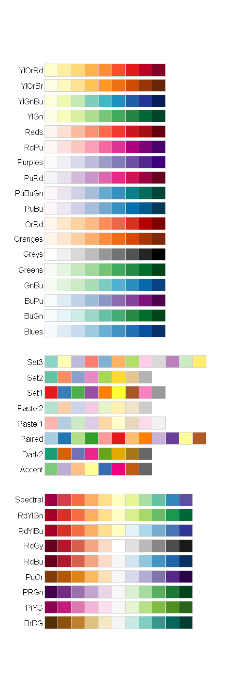
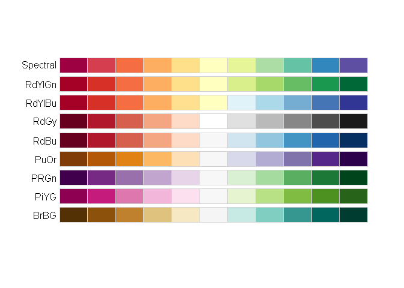
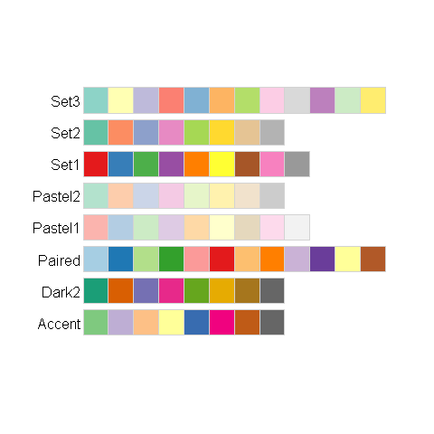
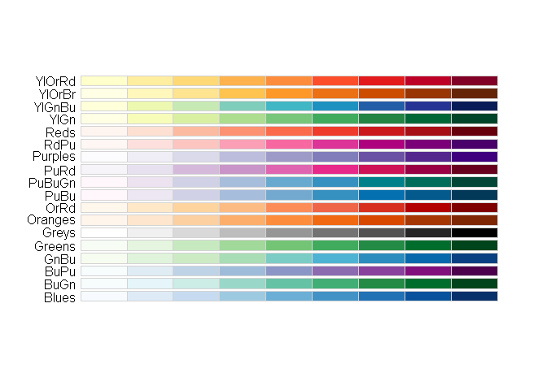

ColorBrewer
================
A Calatroni & J Wildfire
27 February, 2017

-   [packages](#packages)
-   [All](#all)
-   [Diverging palettes](#diverging-palettes)
-   [Qualitative palettes](#qualitative-palettes)
-   [Sequential palettes](#sequential-palettes)
-   [test for color blindness](#test-for-color-blindness)

### packages

``` r
pacman::p_load(RColorBrewer)
```

There are 3 types of palettes, sequential, diverging, and qualitative:
\* **Sequential palettes** are suited to ordered data that progress from low to high. Lightness steps dominate the look of these schemes, with light colors for low data values to dark colors for high data values.
\* **Diverging palettes** put equal emphasis on mid-range critical values and extremes at both ends of the data range. The critical class or break in the middle of the legend is emphasized with light colors and low and high extremes are emphasized with dark colors that have contrasting hues.
\* **Qualitative palettes** do not imply magnitude differences between legend classes, and hues are used to create the primary visual differences between classes. Qualitative schemes are best suited to representing nominal or categorical data.

[ColorBrewer: Color Advice](http://colorbrewer2.org)

### All

``` r
display.brewer.all()
```



### Diverging palettes

``` r
display.brewer.all(type="div")
```



### Qualitative palettes

``` r
display.brewer.all(type="qual")
```



### Sequential palettes

``` r
display.brewer.all(type="seq")
```



### test for color blindness

``` r
pacman::p_load(tmaptools)
palette_explorer()
```
