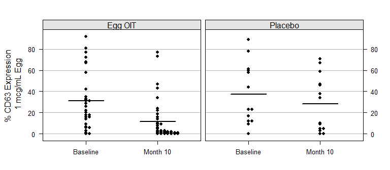
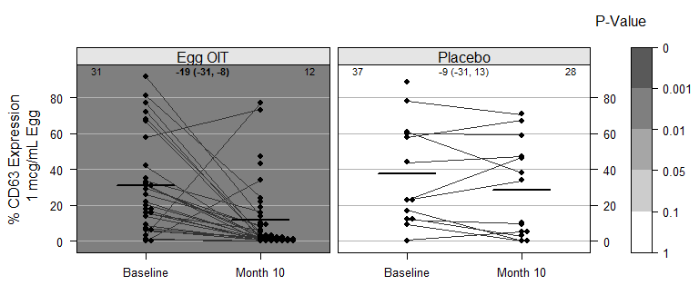
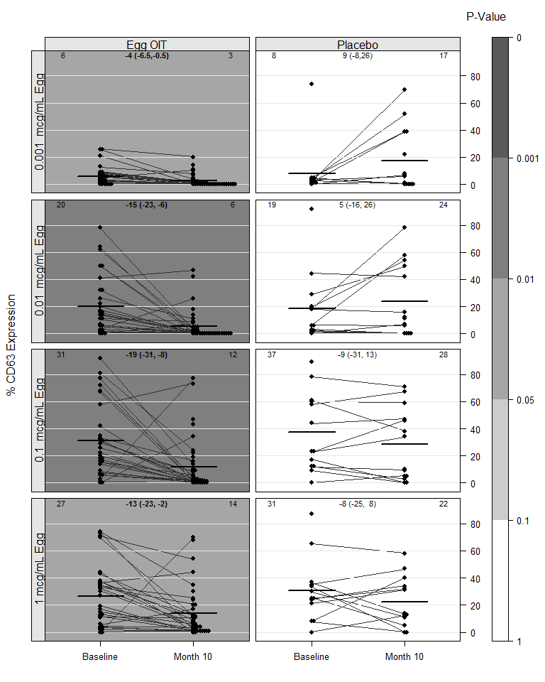

Clinical
================
A Calatroni & J Wildfire
28 February, 2017

-   [set path](#set-path)
-   [packages](#packages)
-   [import data](#import-data)
-   [figure 1](#figure-1)
-   [figure 2](#figure-2)
-   [figure 3](#figure-3)
-   [figure 4](#figure-4)

### set path

``` r
knitr::opts_knit$set(root.dir = '../..')
```

### packages

``` r
pacman::p_load(tidyverse, rio)
pacman::p_load(lattice, latticeExtra, grid)
pacman::p_load(beeswarm)
```

### import data

``` r
dd <- import("./data/derive/egg_baso_data.rds") %>% 
  mutate(trttrue = factor(trttrue))

levels(dd$label) <- c("1 mcg/mL Egg","0.1  mcg/mL Egg",
                      "0.01  mcg/mL Egg","0.001  mcg/mL Egg",
                      "antiIGE","fMLP",
                      "IL-3","Medium" ,
                      "Unstain")
```

### figure 1

``` r
xyplot(value ~ factor(visno) | trttrue, data=dd %>% filter(variable == 'cd63pos2'),
       type = c('p'), cex=0.7, pch=16, col='black',
       par.settings=list(strip.background=list(col="gray90")),
       scale = list(x = list(alternating = 1, tck=c(1,0)),
                    y = list(alternating = 3)),
       between = list(x=0.5, y=0.5),
       xlab = NULL,
       ylab = dd %>% filter(variable == 'cd63pos2') %>% slice(1) %>% select(label),
       panel = function(x,y,...){
         bs <- beeswarm(round(y,0)~x, do.plot=F, corral='none', side=1, spacing=4)
         panel.grid(h=-1,v=0)
         panel.segments(seq(0.75,1.75,1),tapply(y,x,mean,na.rm=T),
                        seq(1.25,2.25,1),tapply(y,x,mean,na.rm=T),
                        lwd=2)
         panel.xyplot(bs$x,bs$y,...)
       })
```



### figure 2

``` r
pal   <- c("gray35","gray50","gray65","gray80","white")
ind   <- c(1,0.1,0.05,0.01,0.001,0)

xyplot(value ~ factor(visno) | trttrue, data=dd %>% filter(variable == 'cd63pos2'),
       group = subject_accession,
       type = c('a'), cex=1, col = 'black', col.line = 'gray20',
       par.settings=list(strip.background=list(col="gray90")),
       scale = list(x = list(alternating = 1, tck=c(1,0)),
                    y = list(alternating = 3)),
       between = list(x=0.5, y=0.5),
       xlab = NULL,
       ylab = dd %>% filter(variable == 'cd63pos2') %>% slice(1) %>% select(label),
       legend = list(top=list(fun=grid::textGrob("P-Value", x=1.06)),
                     right = list(fun = draw.colorkey,
                                  args = list(key = list(col = rev(pal), at = seq(0,1,length=6), 
                                                         labels=list(at=seq(0,1,length=6),labels=ind)), 
                                              draw = FALSE))),
       panel = function(x,y,...){
         t <- t.test(y~relevel(x,ref="Month 10"))
         e <- format(t$estimate, digits = 1, nsmall = 0)
         i <- format(t$conf.int, digits = 1, nsmall = 0)
         d <- format(diff(t$estimate[c(2,1)]), digits = 1, nsmall = 0)
            
         col.ind <- cut(t$p.value,breaks=ind,labels=FALSE)               
         panel.fill(col = pal[col.ind])
         
         grid.text(e,x=c(0.90,0.10),y=0.97,hjust=c(0,1),gp=gpar(cex=0.7))                         
         grid.text(paste(d," (",i[1],",",i[2],")",sep=""),
                   x=0.50,y=0.97,hjust=0.5,gp=gpar(cex=0.7,fontface=ifelse(t$p.value<0.05,2,1)))
         
         panel.grid(h=-1,v=0)
         panel.xyplot(x,y,...)
         
         bs <- beeswarm(round(y,0)~x, do.plot=F, corral='none', side=1, spacing=4)

         panel.grid(h=-1,v=0)
         panel.segments(seq(0.75,1.75,1),tapply(y,x,mean,na.rm=T),
                        seq(1.25,2.25,1),tapply(y,x,mean,na.rm=T),
                        lwd=2)
         panel.xyplot(bs$x,bs$y,type=c('p'),cex=0.7,pch=16, col='black')
       })
```



### figure 3

``` r
pal   <- c("gray35","gray50","gray65","gray80","white")
ind   <- c(1,0.1,0.05,0.01,0.001,0)

useOuterStrips(
  xyplot(value ~ factor(visno) | trttrue * label, data=dd,
         subset=label %in% c("1 mcg/mL Egg","0.1  mcg/mL Egg",
                            "0.01  mcg/mL Egg","0.001  mcg/mL Egg"),
         group = subject_accession,
         type = c('a'), cex=1, col = 'black', col.line = 'gray20',
         par.settings=list(strip.background=list(col="gray90")),
         scale = list(x = list(alternating = 1, tck=c(1,0)),
                      y = list(alternating = 2, tck=c(0,1))),
         between = list(x=0.5, y=0.5),
         ylab="CD63 +",
         xlab = NULL,
         legend = list(top=list(fun=grid::textGrob("P-Value", x=1.06)),
                       right = list(fun = draw.colorkey,
                                    args = list(key = list(col = rev(pal), at = seq(0,1,length=6), 
                                                           labels=list(at=seq(0,1,length=6),labels=ind)), 
                                                draw = FALSE))),
         panel = function(x,y,...){
           t <- t.test(y~relevel(x,ref="Month 10"))
           e <- format(t$estimate, digits = 1, nsmall = 0)
           i <- format(t$conf.int, digits = 1, nsmall = 0)
           d <- format(diff(t$estimate[c(2,1)]), digits = 1, nsmall = 0)
           
           col.ind <- cut(t$p.value,breaks=ind,labels=FALSE)               
           panel.fill(col = pal[col.ind])
           
           grid.text(e,x=c(0.90,0.10),y=0.97,hjust=c(0,1),gp=gpar(cex=0.7))                         
           grid.text(paste(d," (",i[1],",",i[2],")",sep=""),
                     x=0.50,y=0.97,hjust=0.5,gp=gpar(cex=0.7,fontface=ifelse(t$p.value<0.05,2,1)))
           
           panel.grid(h=-1,v=0)
           panel.xyplot(x,y,...)
           
           bs <- beeswarm(round(y,0)~x, do.plot=F, corral='none', side=1, spacing=2)
           panel.grid(h=-1,v=0)
           panel.segments(seq(0.75,1.75,1),tapply(y,x,mean,na.rm=T),
                          seq(1.25,2.25,1),tapply(y,x,mean,na.rm=T),
                          lwd=2)
           panel.xyplot(bs$x,bs$y,type=c('p'),cex=0.7,pch=16, col='black')
         })
)
```



### figure 4

``` r
pal   <- c("gray35","gray50","gray65","gray80","white")
ind   <- c(1,0.1,0.05,0.01,0.001,0)

useOuterStrips(
xyplot(value ~ factor(visno) | trttrue * reorder(label,value), data=dd, 
       group = subject_accession,
       type = c('a'), cex=1, col = 'black', col.line = 'gray20',
       par.settings=list(strip.background=list(col="gray90")),
       scale = list(x = list(alternating = 1, tck=c(1,0)),
                    y = list(alternating = 2, tck=c(0,1))),
       between = list(x=0.5, y=0.5),
       ylab="CD63 +",
       xlab = NULL,
       legend = list(top=list(fun=grid::textGrob("P-Value", x=1.06)),
                     right = list(fun = draw.colorkey,
                                  args = list(key = list(col = rev(pal), at = seq(0,1,length=6), 
                                                         labels=list(at=seq(0,1,length=6),labels=ind)), 
                                              draw = FALSE))),
       panel = function(x,y,...){
         t <- t.test(y~relevel(x,ref="Month 10"))
         e <- format(t$estimate, digits = 1, nsmall = 0)
         i <- format(t$conf.int, digits = 1, nsmall = 0)
         d <- format(diff(t$estimate[c(2,1)]), digits = 1, nsmall = 0)
         
         col.ind <- cut(t$p.value,breaks=ind,labels=FALSE)               
         panel.fill(col = pal[col.ind])
         
         grid.text(e,x=c(0.90,0.10),y=0.97,hjust=c(0,1),gp=gpar(cex=0.7))                         
         grid.text(paste(d," (",i[1],",",i[2],")",sep=""),
                   x=0.50,y=0.97,hjust=0.5,gp=gpar(cex=0.7,fontface=ifelse(t$p.value<0.05,2,1)))
         
         panel.grid(h=-1,v=0)
         panel.xyplot(x,y,...)
         
         bs <- beeswarm(round(y,0)~x, do.plot=F, corral='none', side=1, spacing=2)
         panel.grid(h=-1,v=0)
         panel.segments(seq(0.75,1.75,1),tapply(y,x,mean,na.rm=T),
                        seq(1.25,2.25,1),tapply(y,x,mean,na.rm=T),
                        lwd=2)
         panel.xyplot(bs$x,bs$y,type=c('p'),cex=0.7,pch=16, col='black')
       })
)
```


