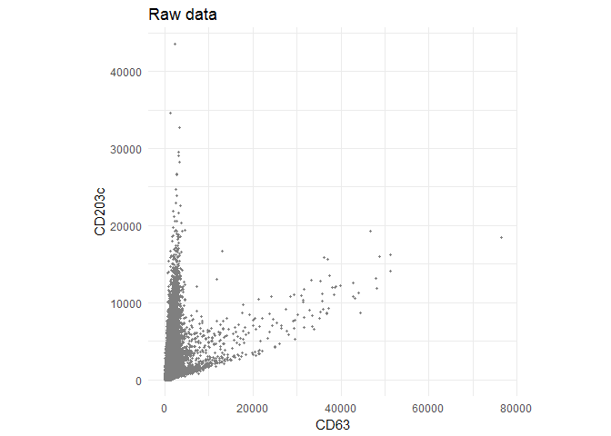
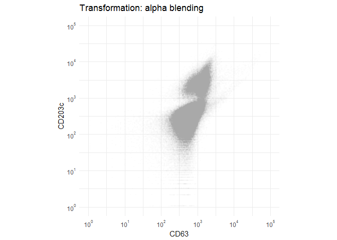
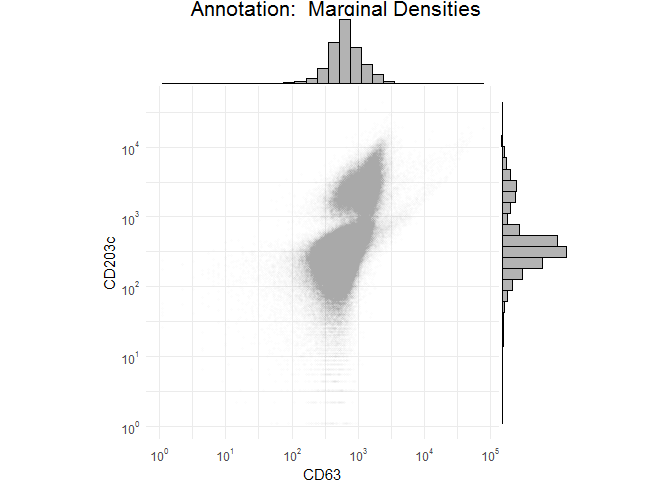

Scatterplot Flow
================
A Calatroni & J Wildfire
27 February, 2017

-   [set path](#set-path)
-   [packages](#packages)
-   [import data](#import-data)
-   [Figure 1](#figure-1)
-   [Figure 2](#figure-2)
-   [Figure 3](#figure-3)
-   [Figure 4](#figure-4)
-   [Figure 5](#figure-5)
-   [Figure 6](#figure-6)
-   [Figure 7](#figure-7)

### set path

``` r
knitr::opts_knit$set(root.dir = '../..')
```

### packages

``` r
pacman::p_load(tidyverse, rio)
pacman::p_load(scales)
```

### import data

``` r
df1 <- import("./data/derive/egg_flow_data.rds") 
```

### Figure 1

``` r
ggplot(df1$data[[2]] %>% filter(FITC.A >0, PE.A>0),aes(FITC.A,PE.A)) + 
  geom_point(col='gray50', size=0.7) +
  labs(x="CD63", y="CD203c",
       title = "Raw data") +
  theme_minimal() + 
  theme(aspect.ratio=1)
```


### Figure 2

``` r
ggplot(df1$data[[2]] %>% filter(FITC.A >0, PE.A>0),aes(FITC.A,PE.A)) + 
  geom_point(col='gray50', size=0.7) +
  scale_y_log10(
    breaks = trans_breaks("log10", function(x) 10^x),
    labels = trans_format("log10", math_format(10^.x))) +
  scale_x_log10(
    breaks = trans_breaks("log10", function(x) 10^x),
    labels = trans_format("log10", math_format(10^.x))) +
  labs(x="CD63", y="CD203c",
       title = "Transformation: log axis") +
  theme_minimal() + 
  theme(aspect.ratio=1)
```



### Figure 3

``` r
ggplot(df1$data[[2]] %>% filter(FITC.A >0, PE.A>0),aes(FITC.A,PE.A)) +  
  geom_point(col='gray50', size=0.7, alpha=1/100) +
  scale_y_log10(
    breaks = trans_breaks("log10", function(x) 10^x),
    labels = trans_format("log10", math_format(10^.x))) +
  scale_x_log10(
    breaks = trans_breaks("log10", function(x) 10^x),
    labels = trans_format("log10", math_format(10^.x))) +
  labs(x="CD63", y="CD203c",
       title = "Transformation: alpha blending") +
  theme_minimal() + 
  theme(aspect.ratio=1)
```


### Figure 4

``` r
pacman::p_load(ggExtra)
b <- ggplot(df1$data[[2]] %>% filter(FITC.A >0, PE.A>0),aes(FITC.A,PE.A)) +  
  geom_point(col='gray50', size=0.7, alpha=1/100) +
  scale_y_log10(
    breaks = trans_breaks("log10", function(x) 10^x),
    labels = trans_format("log10", math_format(10^.x))) +
  scale_x_log10(
    breaks = trans_breaks("log10", function(x) 10^x),
    labels = trans_format("log10", math_format(10^.x))) +
  labs(x="CD63", y="CD203c",
       title = "Annotation:  Marginal Densities") +
  theme_minimal() + 
  theme(aspect.ratio=1)
ggMarginal(b, type = "histogram", fill = "gray70")
```

    ## `stat_bin()` using `bins = 30`. Pick better value with `binwidth`.



``` r
ggMarginal(b, type = "density")
```


### Figure 5

``` r
ggplot(df1$data[[2]] %>% filter(FITC.A >0, PE.A>0),aes(FITC.A,PE.A)) + 
  geom_point(col='transparent', size=0.01) +
  stat_bin_hex(colour="white", bins=64, na.rm=TRUE) +
  scale_fill_distiller(palette = "Blues", direction=1, guide=FALSE) +
  scale_y_log10(
    breaks = trans_breaks("log10", function(x) 10^x),
    labels = trans_format("log10", math_format(10^.x))) +
  scale_x_log10(
    breaks = trans_breaks("log10", function(x) 10^x),
    labels = trans_format("log10", math_format(10^.x))) +
  labs(x="CD63", y="CD203c",
       title = "Trasformations: Hexagons Binning") +
  theme_minimal() + 
  theme(aspect.ratio=1)
```



### Figure 6

``` r
ggplot(df1$data[[2]] %>% filter(FITC.A >0, PE.A>0),aes(FITC.A,PE.A)) +  
  geom_point(col='gray50', size=0.7, alpha=1/100) +
  stat_density2d(aes(fill = ..level..), contour=TRUE, color='gray50', geom="polygon") +
  scale_fill_distiller(palette = "Blues", direction=1, guide=FALSE) + 
  scale_y_log10(
    breaks = trans_breaks("log10", function(x) 10^x),
    labels = trans_format("log10", math_format(10^.x))) +
  scale_x_log10(
    breaks = trans_breaks("log10", function(x) 10^x),
    labels = trans_format("log10", math_format(10^.x))) +
  labs(x="CD63", y="CD203c",
       title = "Transformation: Contours") +
  theme_minimal() + 
  theme(aspect.ratio=1)
```


### Figure 7

``` r
df2 <- df1 %>% unnest(data) %>% filter(FITC.A >0, PE.A>0)
ggplot(df2,aes(FITC.A,PE.A)) +
  geom_point(col='gray50', size=0.7, alpha=1/100) +
  stat_density2d(aes(fill = ..level..), contour=TRUE, color='gray50', geom="polygon") +
  scale_fill_distiller(palette = "Blues", direction=1, guide=FALSE) + 
  scale_y_log10(
    breaks = trans_breaks("log10", function(x) 10^x),
    labels = trans_format("log10", math_format(10^.x))) +
  scale_x_log10(
    breaks = trans_breaks("log10", function(x) 10^x),
    labels = trans_format("log10", math_format(10^.x))) +
  labs(x="CD63", y="CD203c",
       title = "Expand: Facets") +
  theme_minimal() + 
  theme(aspect.ratio=1)+
  facet_grid(arm_name~planned_visit_name)
```


