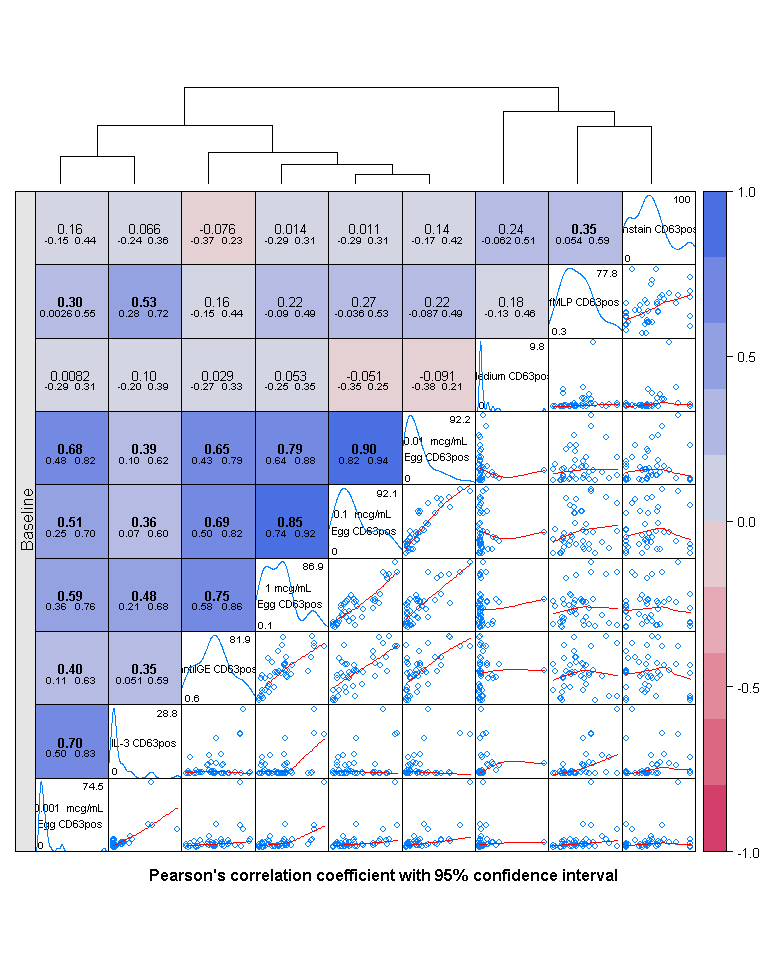
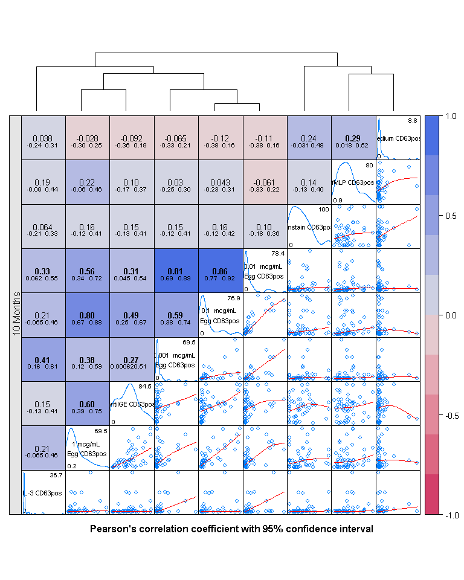

Splom
================
A Calatroni & J Wildfire
27 February, 2017

-   [setup](#setup)
    -   [set path](#set-path)
    -   [packages](#packages)
    -   [import data](#import-data)
-   [Panels](#panels)
    -   [diagonal panels](#diagonal-panels)
    -   [upper panels](#upper-panels)
    -   [lower panels](#lower-panels)
-   [Baseline Data](#baseline-data)
    -   [Subset](#subset)
    -   [Hiearchical clustering](#hiearchical-clustering)
    -   [Splom (Baseline)](#splom-baseline)
-   [10 Month Data](#month-data)
    -   [Subset](#subset-1)
    -   [Hiearchical clustering](#hiearchical-clustering-1)
    -   [Splom (Month 10)](#splom-month-10)

setup
-----

### set path

``` r
knitr::opts_knit$set(root.dir = '../..')
```

### packages

``` r
pacman::p_load(tidyverse, rio)
pacman::p_load(lattice, latticeExtra, grid)
pacman::p_load(colorspace)
pacman::p_load(reshape2)
pacman::p_load(Hmisc)
```

### import data

``` r
dd <- import("./data/derive/egg_baso_data.rds") %>% 
  dcast(subject_accession + trttrue + visno ~ label)
```

Panels
------

### diagonal panels

``` r
my.diag.panel <- function(x=NULL, varname = NULL,...){      
  grid.text(varname, gp = gpar(cex=0.7))  
  minx <- round(min(x, na.rm = TRUE), 2)
  maxx <- round(max(x, na.rm = TRUE), 2)
  grid.text(round(minx,1), 0.05, 0.1, just=c("left","center") ,gp=gpar(cex=0.6))
  grid.text(round(maxx,1), 0.95, 0.9, just=c("right","center"),gp=gpar(cex=0.6))
  
  yrng <- current.panel.limits()$ylim  
  ok <- is.finite(x)
  if (any(ok))
    d <- density(x[ok])
  d$y <- with(d, yrng[1] + 0.95 * diff(yrng) * y / max(y, na.rm=T) )
  panel.lines(d)
}
```

### upper panels

``` r
my.upper.panel <- function(x, y, ...) {
  r    <- cor.test(x,y)
  ncol <- 10
  pal     <- rev(diverge_hcl(ncol, c = 100, l = c(50, 90), power = 1))
  col.ind <- cut(r$estimate,breaks=seq(-1,1,length.out=(ncol+1)),labels=FALSE)
  panel.fill(col = pal[col.ind])
  grid.text(format(r$estimate,digits=2,nsmall=2),   0.5, 0.5,  
            gp=gpar(fontface=ifelse(r$p.value<0.05,2,1),cex=0.8))
  grid.text(format(r$conf.int[1],digits=2,nsmall=2),0.3, 0.35, 
            gp=gpar(fontface=ifelse(r$p.value<0.05,2,1),cex=0.6))
  grid.text(format(r$conf.int[2],digits=2,nsmall=2),0.7, 0.35, 
            gp=gpar(fontface=ifelse(r$p.value<0.05,2,1),cex=0.6))
}
```

### lower panels

``` r
my.lower.panel <- function (x, y, ...) {
  panel.xyplot(x, y, type=c("p","smooth"), col.line='red',...)
}
```

Baseline Data
-------------

### Subset

``` r
dd_0 <- dd %>% 
  filter(visno == 'Baseline') %>% 
  select(-c(1:3))

names(dd_0)[1:4] <- c("1 mcg/mL \nEgg CD63pos","0.1  mcg/mL \nEgg CD63pos",
                      "0.01  mcg/mL \nEgg CD63pos","0.001  mcg/mL \nEgg CD63pos")
```

### Hiearchical clustering

``` r
vc    <- varclus(as.matrix(cor(data.matrix(dd_0),use="pairwise.complete.obs")),
                 similarity="pearson",type="similarity.matrix")
dd.col  <- as.dendrogram(vc$hclust)
col.ord <- order.dendrogram(dd.col)
```

### Splom (Baseline)

``` r
splom(~dd_0[, col.ord]|"Baseline", data=dd_0, strip.left=TRUE, strip=FALSE, span=1,  
      xlab="",ylab="", cex=0.70,
      sub="Pearson's correlation coefficient with 95% confidence interval",
      par.settings=list(strip.background=list(col="gray90")),
      diag.panel = my.diag.panel,
      upper.panel = my.upper.panel,      
      lower.panel = my.lower.panel,
      legend = list(
        right = list( fun = draw.colorkey,
                      args = list(key = list(col = rev(diverge_hcl(20, c = 100, l = c(50, 90), power = 1)),
                                             at = seq(-1,1,0.2))),draw = FALSE),
        top = list(fun = dendrogramGrob, args = list(x = dd.col, ord=col.ord, size=05, side = "top")))
)
```



10 Month Data
-------------

### Subset

``` r
dd_10 <- dd %>% 
  filter(visno == 'Month 10') %>% 
  select(-c(1:3))

names(dd_10)[1:4] <- c("1 mcg/mL \nEgg CD63pos","0.1  mcg/mL \nEgg CD63pos",
                       "0.01  mcg/mL \nEgg CD63pos","0.001  mcg/mL \nEgg CD63pos")
```

### Hiearchical clustering

``` r
vc    <- varclus(as.matrix(cor(data.matrix(dd_10),use="pairwise.complete.obs")),
                 similarity="pearson",type="similarity.matrix")
dd.col  <- as.dendrogram(vc$hclust)
col.ord <- order.dendrogram(dd.col)
```

### Splom (Month 10)

``` r
splom(~dd_10[, col.ord]|"10 Months", data=dd_10, strip.left=TRUE, strip=FALSE, span=1,  
      xlab="",ylab="", cex=0.70,
      sub="Pearson's correlation coefficient with 95% confidence interval",
      par.settings=list(strip.background=list(col="gray90")),
      diag.panel = my.diag.panel,
      upper.panel = my.upper.panel,      
      lower.panel = my.lower.panel,
      legend = list(
        right = list( fun = draw.colorkey,
                      args = list(key = list(col = rev(diverge_hcl(20, c = 100, l = c(50, 90), power = 1)),
                                             at = seq(-1,1,0.2))),draw = FALSE),
        top = list(fun = dendrogramGrob, args = list(x = dd.col, ord=col.ord, size=05, side = "top")))
)
```


