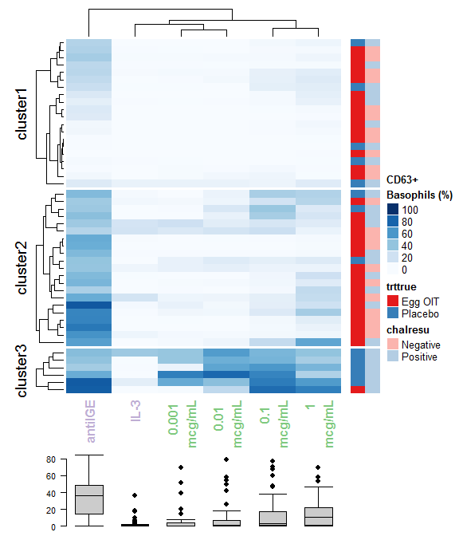

Levelplot
================
A Calatroni & J Wildfire
08 May, 2017

-   [setup](#setup)
-   [packages](#packages)
-   [citation](#citation)
-   [import data](#import-data)
-   [prepare for plot](#prepare-for-plot)
-   [levelplot](#levelplot)

### setup

``` r
knitr::opts_knit$set(root.dir = '../..')
knitr::opts_chunk$set(warning = FALSE, message = FALSE, comment = NA)
```

### packages

``` r
pacman::p_load(tidyverse, rio)
pacman::p_load(lattice, latticeExtra, grid)
pacman::p_load(colorspace)
pacman::p_load(reshape2)
pacman::p_load(ComplexHeatmap, circlize)
```

### citation

Further details and examples can be found in the package author [github](https://github.com/jokergoo/ComplexHeatmap)

### import data

``` r
dd <- import("./data/derive/egg_baso_data.rds") %>% 
  dcast(subject_accession + trttrue + chalresu + visno ~ label) %>% 
  select(1:4,5:9,11) %>% 
  na.omit()

dd_c <- dd %>% filter(visno == "Month 10") %>% select(1:4)
dd_n <- dd %>% filter(visno == "Month 10") %>% select(-c(1:4))

names(dd_n) <- c("1 \nmcg/mL","0.1  \nmcg/mL","0.01  \nmcg/mL","0.001 \nmcg/mL","antiIGE","IL-3")
```

### prepare for plot

``` r
# create matrix
df     <- as.matrix(dd_n) 
# create color schema
blues_fun <- colorRampPalette(brewer.pal(9,"Blues"))
# columns
ha_boxplot = HeatmapAnnotation(boxplot = anno_boxplot(df, which="column", axis = TRUE, border = FALSE))
# rows
annot_df <- data.frame(trttrue  = dd_c$trttrue, 
                       chalresu = dd_c$chalresu)
col = list(trttrue = c("Egg OIT" = "#E41A1C", "Placebo" = "#377EB8"),
           chalresu = c("Negative" = "#FBB4AE", "Positive" = "#B3CDE3"))
# Create the heatmap annotation
ha <- rowAnnotation(annot_df, 
                    col = col)
```

### levelplot

``` r
Heatmap(df, km=3,
        col = colorRamp2(seq(0, 100, length = 11), blues_fun(11)),
        column_names_gp = gpar(font=2, col =  c(rep('#7FC97F',4),rep('#BEAED4',2))),
        name = "CD63+ \nBasophils (%)",
        bottom_annotation = ha_boxplot,
        bottom_annotation_height = unit(0.15, "npc")
) + ha
```


