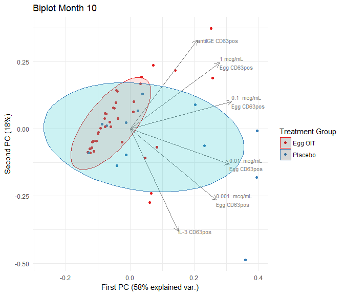

PCA
================
A Calatroni & J Wildfire
27 February, 2017

-   [set path](#set-path)
-   [packages](#packages)
-   [import data](#import-data)
-   [subset data](#subset-data)
-   [pca](#pca)
-   [pca figure](#pca-figure)

### set path

``` r
knitr::opts_knit$set(root.dir = '../..')
```

### packages

``` r
pacman::p_load(tidyverse, rio)
pacman::p_load(lattice, latticeExtra, grid)
pacman::p_load(colorspace)
pacman::p_load(reshape2)
pacman::p_load(ggfortify)
```

### import data

``` r
dd <- import("./data/derive/egg_baso_data.rds") %>% 
  dcast(subject_accession + trttrue + visno ~ label)
```

### subset data

``` r
dd_10 <- dd %>% 
  filter(visno=="Month 10") %>% 
  na.omit() %>% 
  select(1:8,10)

names(dd_10)[4:7] <- c("1 mcg/mL \nEgg CD63pos","0.1  mcg/mL \nEgg CD63pos",
                       "0.01  mcg/mL \nEgg CD63pos","0.001  mcg/mL \nEgg CD63pos")
```

### pca

``` r
prcomp(dd_10[,-c(1:3)], scale. = TRUE) %>% summary()
```

    ## Importance of components:
    ##                           PC1    PC2    PC3     PC4     PC5    PC6
    ## Standard deviation     1.8621 1.0382 0.8835 0.66313 0.43314 0.2164
    ## Proportion of Variance 0.5779 0.1797 0.1301 0.07329 0.03127 0.0078
    ## Cumulative Proportion  0.5779 0.7575 0.8876 0.96093 0.99220 1.0000

### pca figure

``` r
autoplot( prcomp(dd_10[,-c(1:3)], scale. = TRUE), data=dd_10 , colour='trttrue',
          frame = TRUE,
          frame.type = 't',
          frame.level = 0.80,
          loadings = TRUE, 
          loadings.colour = 'gray50',
          loadings.label = TRUE,
          loadings.label.colour = 'gray50',
          loadings.label.size = 3,
          loadings.label.hjust = 0, 
          loadings.label.vjust = 0.5) +
  scale_color_brewer(palette="Set1") +
  labs(title = "Biplot Month 10",
       color = "Treatment Group",
       x = "First PC (58% explained var.)",
       y = "Second PC (18%)") +
  guides(fill = FALSE) +
  theme_minimal()
```


