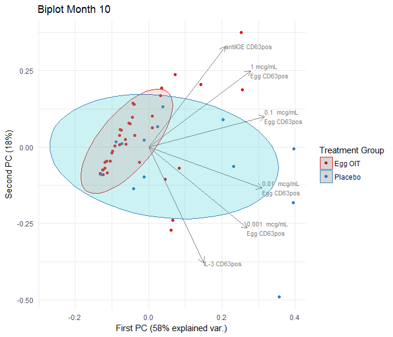

PCA
================
A Calatroni & J Wildfire
08 May, 2017

-   [setup](#setup)
-   [packages](#packages)
-   [citation](#citation)
-   [import data](#import-data)
-   [subset data](#subset-data)
-   [pca](#pca)
-   [pca figure](#pca-figure)

### setup

``` r
knitr::opts_knit$set(root.dir = '../..')
knitr::opts_chunk$set(warning = FALSE, message = FALSE, comment = NA)
```

### packages

``` r
pacman::p_load(tidyverse, rio)
pacman::p_load(lattice, latticeExtra, grid)
pacman::p_load(colorspace)
pacman::p_load(reshape2)
pacman::p_load(ggfortify)
```

### citation

``` r
citation("ggfortify", auto = FALSE) %>% 
  toBibtex()
```

    @Article{,
      author = {Yuan Tang and Masaaki Horikoshi and Wenxuan Li},
      title = {ggfortify: Unified Interface to Visualize Statistical Result of Popular R Packages},
      journal = {The R Journal},
      year = {2016},
      url = {https://journal.r-project.org/},
    }

    @Manual{,
      author = {Masaaki Horikoshi and Yuan Tang},
      title = {ggfortify: Data Visualization Tools for Statistical Analysis Results},
      year = {2016},
      url = {https://CRAN.R-project.org/package=ggfortify},
    }

### import data

``` r
dd <- import("./data/derive/egg_baso_data.rds") %>% 
  dcast(subject_accession + trttrue + visno ~ label)
```

### subset data

``` r
dd_10 <- dd %>% 
  filter(visno=="Month 10") %>% 
  na.omit() %>% 
  select(1:8,10)

names(dd_10)[4:7] <- c("1 mcg/mL \nEgg CD63pos","0.1  mcg/mL \nEgg CD63pos",
                       "0.01  mcg/mL \nEgg CD63pos","0.001  mcg/mL \nEgg CD63pos")
```

### pca

``` r
prcomp(dd_10[,-c(1:3)], scale. = TRUE) %>% summary()
```

    Importance of components%s:
                              PC1    PC2    PC3     PC4     PC5     PC6
    Standard deviation     1.8611 1.0381 0.8835 0.66573 0.43399 0.21546
    Proportion of Variance 0.5773 0.1796 0.1301 0.07387 0.03139 0.00774
    Cumulative Proportion  0.5773 0.7569 0.8870 0.96087 0.99226 1.00000

### pca figure

``` r
autoplot( prcomp(dd_10[,-c(1:3)], scale. = TRUE), data=dd_10 , colour='trttrue',
          frame = TRUE,
          frame.type = 't',
          frame.level = 0.80,
          loadings = TRUE, 
          loadings.colour = 'gray50',
          loadings.label = TRUE,
          loadings.label.colour = 'gray50',
          loadings.label.size = 3,
          loadings.label.hjust = 0, 
          loadings.label.vjust = 0.5) +
  scale_color_brewer(palette="Set1") +
  labs(title = "Biplot Month 10",
       color = "Treatment Group",
       x = "First PC (58% explained var.)",
       y = "Second PC (18%)") +
  guides(fill = FALSE) +
  theme_minimal()
```


