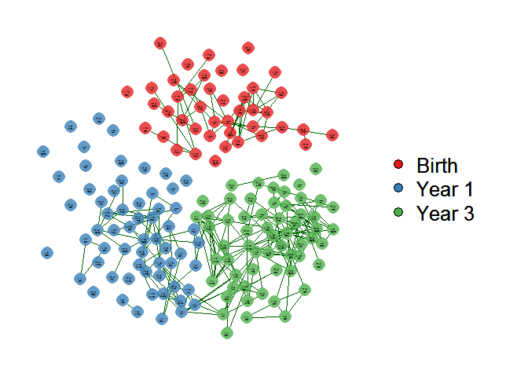

Network
================
A Calatroni & J Wildfire
08 May, 2017

-   [set defaults](#set-defaults)
-   [packages](#packages)
-   [citation](#citation)
-   [Import and Symmetric Matrix](#import-and-symmetric-matrix)
-   [Names Construction](#names-construction)
-   [QGraph](#qgraph)

### set defaults

``` r
knitr::opts_knit$set(root.dir = '../..')
knitr::opts_chunk$set(warning = FALSE, message = FALSE, comment = NA)
```

### packages

``` r
pacman::p_load(tidyverse, rio, reshape2)
pacman::p_load(RColorBrewer)
pacman::p_load(qgraph)
```

### citation

``` r
citation("qgraph", auto = FALSE) %>% 
  toBibtex()
```

    @Article{,
      title = {{qgraph}: Network Visualizations of Relationships in Psychometric Data},
      author = {Sacha Epskamp and Ang\'elique O. J. Cramer and Lourens J. Waldorp and Verena D. Schmittmann and Denny Borsboom},
      journal = {Journal of Statistical Software},
      year = {2012},
      volume = {48},
      number = {4},
      pages = {1--18},
      url = {http://www.jstatsoft.org/v48/i04/},
    }

### Import and Symmetric Matrix

``` r
dd <- import("figures/SupplementalFigure11_Network/NetworkCyto.csv") %>%
  select(-1) %>% 
  as.matrix()

dd <- Matrix::forceSymmetric(dd,"U")
```

### Names Construction

``` r
nn <- colnames(dd)
nn <- as.data.frame(nn)

nn <- nn  %>%
  separate(nn,c("ca","cb","s","y")) %>%
  mutate(cy=paste(ca,cb,sep="."),
         cy2=paste(cy,s,sep="\n"))

col <- brewer.pal(3, "Set1")
nn$col <- with(nn,ifelse(y==0,col[1],ifelse(y==1,col[2],col[3])))

rownames(dd) <- nn$cy2
colnames(dd) <- nn$cy2
```

### QGraph

``` r
set.seed(57817)

qgraph(dd,
       graph='assosciation', layout='spring',
       layout.par = list(niter=5000),
       minimum=0.35,maximum=1,
       arrows=F,
       bg='white',label.color='black',
       color=nn$col,
       groups= factor(nn$y, labels=c("Birth","Year 1", "Year 3")),
       labels=as.factor(nn$cy2),
       legend=T, legend.cex=0.80,
       overlay=F,overlaySize=0.70,
       shape='circle',
       curve=0.2,
       vsize=2.5,label.cex=0.5,
       borders=FALSE, vTrans=200)
```


